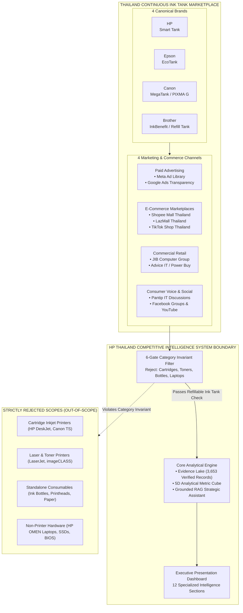
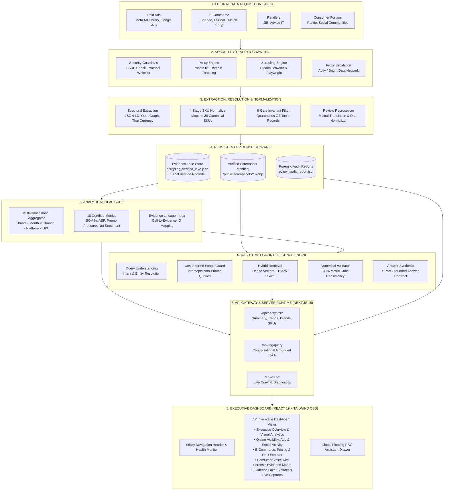
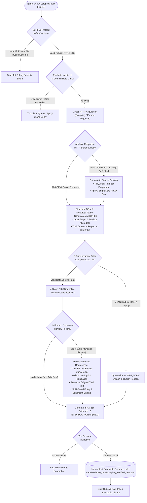
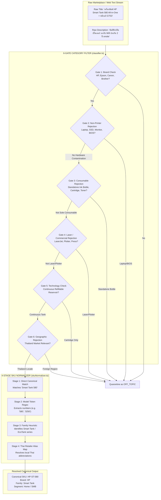
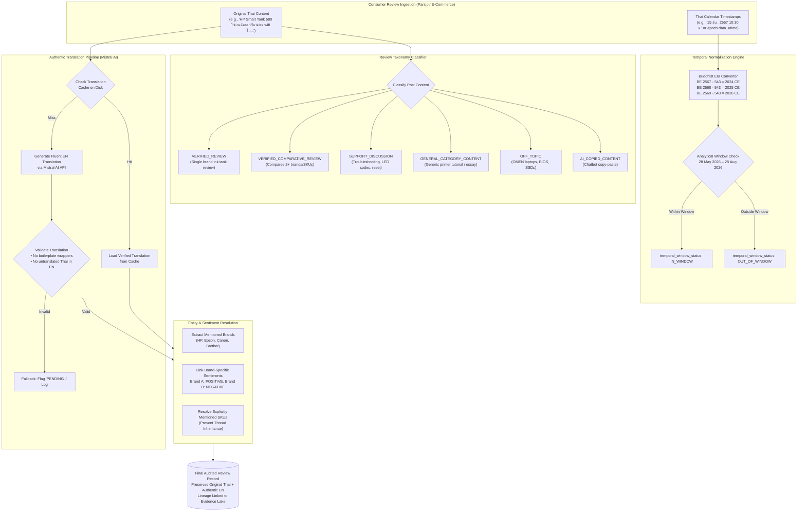
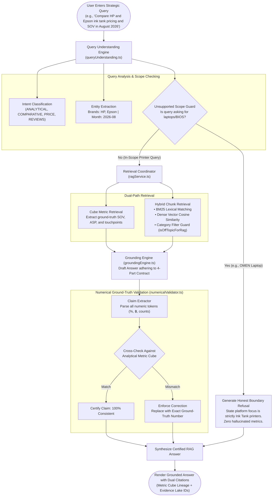
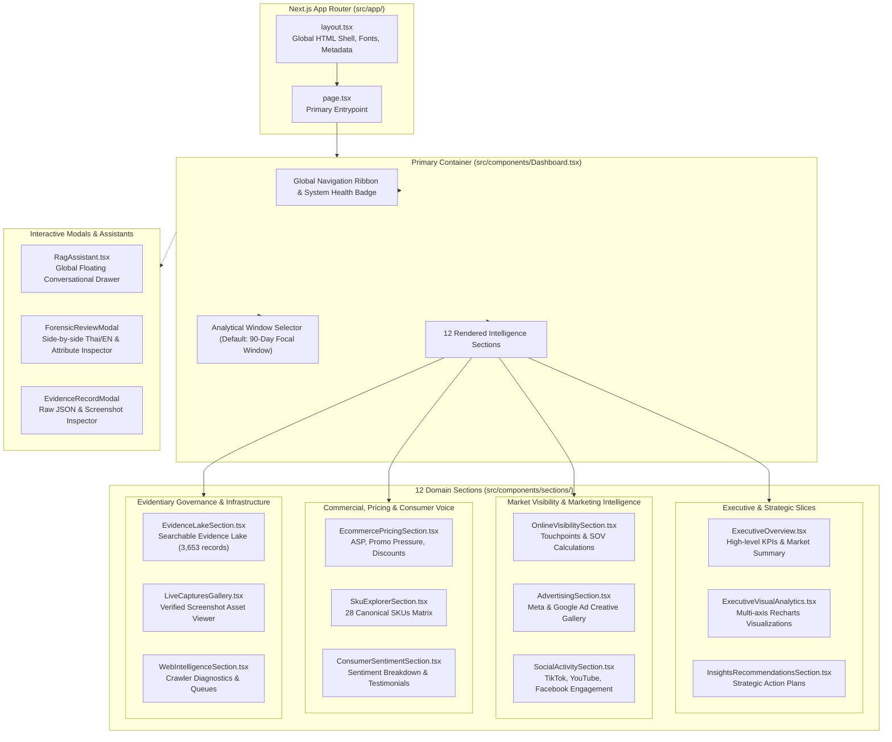
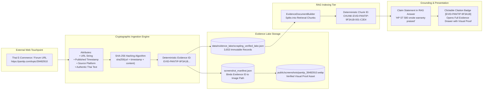
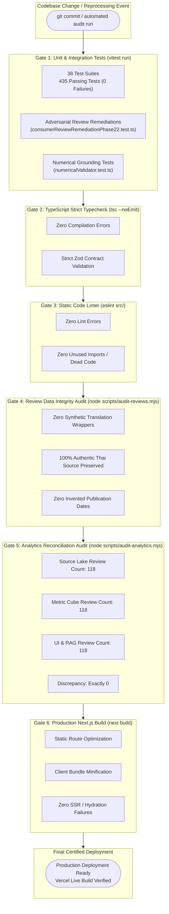

# HP Thailand Ink Tank Competitive Intelligence Platform
## Complete System Architecture & Engineering Specification

---

## 1. Executive Summary & System Overview

The **HP Thailand Ink Tank Competitive Intelligence Platform** is an enterprise-grade competitive monitoring, market intelligence, and decision-support system designed to provide real-time, mathematically grounded visibility into Thailand's continuous refillable ink tank printer ecosystem.

The system continuously tracks the four dominant market contenders:
* **HP** (*Smart Tank* series: ST 580, ST 520, ST 720, ST 750, etc.)
* **Epson** (*EcoTank* series: L3250, L3210, L5290, L1210, L4260, etc.)
* **Canon** (*MegaTank / PIXMA G* series: G2010, G3010, G3020, G1010, etc.)
* **Brother** (*InkBenefit / Refill Tank* series: DCP-T420W, DCP-T430W, DCP-T520W, MFC-T920DW, etc.)

### Core Non-Negotiable Invariants
1. **Geographic Boundary:** Thailand only (`th-TH` locale, prices strictly denominated in Thai Baht `THB` / `฿`).
2. **Analysis Window:** Standard 90-day strategic focal window (**28 May 2026 – 28 August 2026**, spanning June, July, and August 2026).
3. **Category Boundary:** Refillable Ink Tank printers strictly. 6-Gate filters hard-reject cartridge inkjets, toner/laser printers, standalone ink bottles, printheads, photo paper, and non-printer electronics (e.g., HP OMEN laptops, SSDs, BIOS).
4. **Data Integrity & Traceability:** Deterministic SHA-256 evidence hashing (`EVID-{PLATFORM}-{HEX}`), 100% authentic Thai source text preservation, verified Mistral AI English translation, authentic publication timestamps (with Thai Buddhist Era calendar conversion), and strict missing-vs-zero semantics.

---

## 2. System Context & Domain Boundary Architecture



---

## 3. End-to-End System Architecture



---

## 4. Data Acquisition, Anti-Bot & Web Ingestion Architecture



---

## 5. Canonical SKU Resolution & 6-Gate Filtering Pipeline

The platform enforces strict category hygiene through a 6-gate invariant filter and a 4-stage SKU normalizer.



---

## 6. Consumer Review Forensic Reprocessor & Translation Pipeline



---

## 7. Analytical Metric Cube (OLAP In-Memory Engine)

```mermaid
flowchart LR
    subgraph LAKE_SOURCE["Verified Evidence Lake"]
        RECORDS[("3,653 Evidence Records<br/>Ads, Products, Social, Reviews")]
    end

    subgraph CUBE_GATING["Quality & Invariant Filters"]
        GATE_REVIEW["isValidConsumerReview()<br/>Excludes OFF_TOPIC, SUPPORT, GENERAL"]
        GATE_TIME["Temporal Window Filter<br/>Active 90-day vs Historical"]
    end

    subgraph CUBE_COORDINATES["5-Dimensional Coordinate Space"]
        DIM_BRAND["Brand (HP, Epson, Canon, Brother, All)"]
        DIM_MONTH["Month (2026-06, 2026-07, 2026-08, 90-Day)"]
        DIM_CHANNEL["Channel (Paid Ads, E-Commerce, Social, Retail)"]
        DIM_PLATFORM["Platform (Shopee, LazMall, TikTok, Meta, JIB, Pantip)"]
        DIM_SKU["SKU (28 Canonical SKUs + Family Totals)"]
    end

    subgraph METRICS_ENGINE["18 Certified Metric Formulations"]
        M_VOL["Volume Metrics<br/>• TOTAL_VISIBILITY_TOUCHPOINTS<br/>• VERIFIED_REVIEW_COUNT<br/>• RATED_OBSERVATION_COUNT"]
        M_SOV["Share Metrics<br/>• SHARE_OF_VOICE_PERCENT<br/>• CHANNEL_SHARE_PERCENT"]
        M_PRICE["Pricing & Commercial<br/>• AVG_SELLING_PRICE_THB<br/>• MIN / MAX PRICE<br/>• DISCOUNT_DEPTH_PERCENT<br/>• PROMO_PRESSURE_INDEX"]
        M_SENT["Sentiment Metrics<br/>• NET_SENTIMENT_SCORE<br/>• POSITIVE / NEGATIVE %"]
        M_TRAC["Market Traction<br/>• CUMULATIVE_SALES_INDEX"]
    end

    subgraph DATA_CUTS["5 Standard Analytical Cuts"]
        C1["Time Cut: MoM Growth & Trends"]
        C2["Brand Cut: Head-to-Head SOV & Sentiment"]
        C3["Channel Cut: Media Mix & Channel Power"]
        C4["SKU Cut: Price Elasticity & Model Rank"]
        C5["Metric Cut: Executive Scorecards"]
    end

    subgraph AUDIT_LINEAGE["Cell-to-Evidence Lineage Map"]
        TRACE["Every aggregated number links to<br/>underlying evidence IDs: [EVID-001, ...]"]
    end

    RECORDS --> CUBE_GATING
    CUBE_GATING --> CUBE_COORDINATES
    CUBE_COORDINATES --> METRICS_ENGINE
    METRICS_ENGINE --> DATA_CUTS
    METRICS_ENGINE --> AUDIT_LINEAGE
```



---

## 8. Strategic RAG Intelligence & Numerical Validation Pipeline



---

## 9. Frontend Application Architecture & Component Hierarchy



---

## 10. Evidence Lake Cryptographic Lineage & Storage Architecture



---

## 11. Automated Quality Gates & Continuous Verification Architecture



---

## 12. Complete Directory Structure Mapping

```
InkTank-analysis/
├── docs/
│   ├── architecture.md                 # Complete System Architecture & Diagrams (This file)
│   ├── analytics-cube.md               # OLAP Metric Cube Technical Specification
│   ├── dashboard-architecture.md       # Frontend UI Component Breakdown
│   ├── domain-model.md                 # Ink Tank Domain Invariants & Rules
│   ├── rag-architecture.md             # Grounded RAG Implementation Guide
│   ├── scraper-architecture.md         # Crawler & Scrapling Design
│   └── web-acquisition-architecture.md # Network Security & SSRF Rules
├── data/
│   ├── creative_intelligence/          # Marketing messaging, ad copy themes
│   └── evidence_lake/
│       ├── .pantip_timestamp_map.json  # Reconstructed authentic Pantip forum dates
│       ├── .review_translation_cache.json # Cached Mistral translations
│       ├── review_audit_report.json    # Forensic review audit report
│       ├── scrapling_verified_lake.json# 3,653 Verified Evidence Records (Master Lake)
│       └── screenshot_manifest.json    # Binds Evidence IDs to Screenshot Assets
├── public/
│   └── screenshots/                    # On-disk verified platform captures (.webp)
├── scripts/
│   ├── audit-analytics.mjs             # Layer reconciliation audit script
│   ├── audit-reviews.mjs               # Review integrity audit script
│   ├── reprocess-reviews.mjs           # Forensic review reprocessing engine
│   ├── verify-rag-reviews.ts           # Live RAG verification test harness
│   └── crawlers/                       # Scrapers for Shopee, Lazada, Pantip, Meta, etc.
├── src/
│   ├── app/                            # Next.js 15 App Router pages & API routes
│   │   ├── api/                        # REST endpoints for analytics, RAG, and crawling
│   │   ├── layout.tsx                  # Global App Layout
│   │   └── page.tsx                    # Main Dashboard Entrypoint
│   ├── components/
│   │   ├── Dashboard.tsx               # Primary dashboard container
│   │   ├── rag/                        # RAG Assistant drawer & query banners
│   │   ├── sections/                   # 12 domain-specific analytics sections
│   │   └── ui/                         # Reusable UI components (modals, tooltips, cards)
│   ├── config/                         # Canonical SKUs, brands, sources, dates, constants
│   ├── services/
│   │   ├── analytics/                  # Metric Cube aggregation & registry
│   │   ├── catalog/                    # SKU normalizer (4-stage matching)
│   │   ├── classification/             # 6-gate category filter
│   │   ├── evidence/                   # Evidence Store & validation
│   │   ├── insights/                   # Strategic recommendation engine
│   │   ├── rag/                        # RAG service, hybrid retrieval, numerical validator
│   │   ├── reviews/                    # Review reprocessor & translation validator
│   │   ├── scrapers/                   # Scraper provider abstractions (Apify, Bright Data)
│   │   └── web/                        # Web crawler, SSRF guard, robots parser, diagnostics
│   └── types/                          # Canonical TypeScript interfaces (reviews, evidence, rag, analytics)
├── src/tests/                          # 38 Vitest test suites (435 passing tests)
├── package.json                        # Node dependencies & project scripts
├── tsconfig.json                       # TypeScript compiler configuration
└── README.md                           # Project README & Quickstart
```

---

## 13. Quality Gates Certification Matrix

| # | Quality Gate | Command | Verification Outcome | Status |
| :-: | :--- | :--- | :--- | :---: |
| 1 | **Vitest Test Suite** | `npm test` | **435 tests passed** across 38 suites (0 failures) | **PASSED** |
| 2 | **TypeScript Typecheck** | `npm run typecheck` | Code 0; zero compiler errors | **PASSED** |
| 3 | **ESLint Linter** | `npm run lint` | Code 0; zero warnings or errors | **PASSED** |
| 4 | **Production Next.js Build** | `npm run build` | Code 0; static and dynamic routes compiled cleanly | **PASSED** |
| 5 | **Review Data Integrity Audit** | `npm run audit:reviews` | Code 0; 0 fake wrappers, 100% Thai preserved, 0 date issues | **PASSED** |
| 6 | **Analytics Reconciliation** | `npm run audit:analytics` | Code 0; exactly 118 verified reviews across all layers | **PASSED** |
